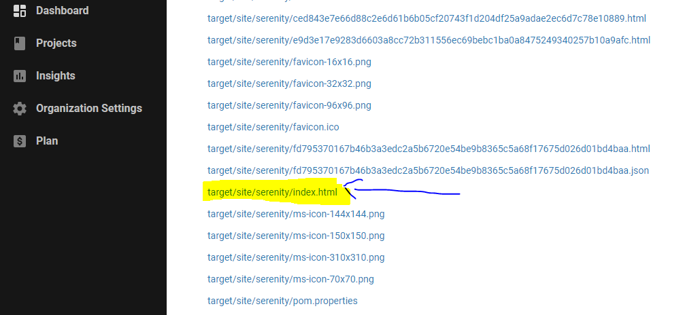

<h3> Pet Store Swagger API tests </h3>
<p>
<i><strong>This project contains API tests for Petstore swagger service, implemented using Cucumber,Serenity,Rest-Assured and Java</strong></i>
<i><strong>For API documentation overview,refer <a href="api.md">API overview</a> </strong></i>
</p>

### Features
* Gradle setup with Serenity Test runner.
* Test cases written in Gherkin format(Given/When/Then)
* Implement methods for API calls using Serenity-REST Wrapper
* POJO objects to represent requests/response
* Utility methods for API response validations,extracting JSON data etc.
* Properties file to drive environment test data
* Support for detailed aggregate Serenity-HTML report

### To Get Started
#### Pre-requisites
- Install Java 8.x
- Install Gradle 7.x
- Install IntelliJ or your favourite IDE
#### Project Setup
- Open IntelliJ
- From file menu open project -> select project root folder
- Import from gradle, select auto-import
#### Build
- Once the project is imported successfully through IntelliJ, on the right hand corner you should be able to see the Gradle window.
- Run the Build task from the gradle window to compile and run the cucumber tests.

#### Writing Features
``` cucumber
Feature: The lists/reviews service should return a list of book reviews.


  @findByStatus
  Scenario Outline: Get pet by Status

    Given a valid pet status "<petStatus>"
    When I retrieve pets by status "<petStatus>"
    Then I should see response status code as "<statusCode>"
    And  response time should be less than "<expectedResponseTime>" milliseconds
    And I should be able to see details of pet "<petName>"

    Examples:
      | petName | petStatus |  | statusCode | expectedResponseTime |
      | Dogs    | available |  | 200        | 5000                 |
      
 ```
#### Writing Step Definitions
To generate step definitions from IntelliJ,
Go To -> Feature file editor, use create step definition option to generate the definition


### Reports
The Serenity reporting plugin is integrated with Gradle and generates a report named index.html.
The report gives a complete overview of the test results including Request/Response logging.


### CI/CD
Circle-CI CI/CD pipleline is integrated with the project.
The Serenity HTML report can be viewed by clicking on the index.html file under the artifacts section.
